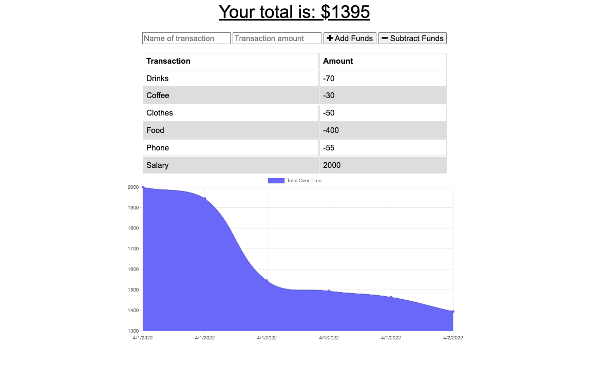

# Danielle's Budget Tracker
This applications provides users with a fast and easy way to track their money. As a PWA this budget tracker allows users to access their application even when offline or with a limited connection. This application uses IndexDB, Service workers, and Web Manifest for offline functionality and is deployed on Heroku.

## Table of Contents
* Preview
* Installation
* Usage
* License 

## Preview

View the application on Heroku: https://protected-crag-81622.herokuapp.com/ 

## Installation
The user should clone the repository from GitHub and install dependencies. To run server, run npm start.

## Usage
This application allows users to track their budget with deposits and withdrawals. This app can be used with or without an internet connection. View the application on Heroku and download the application to your desktop or your phone for ease of acccess and use. 

## License 
This project is licensed under MIT.

